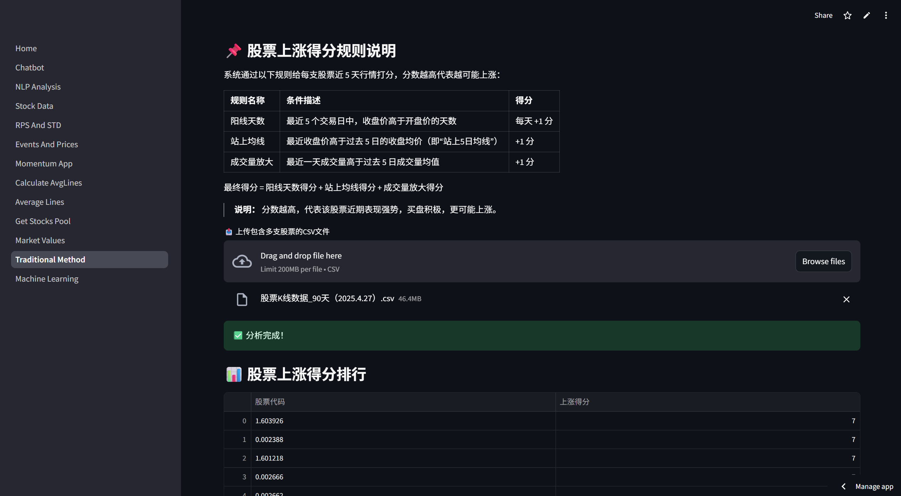

# FinTech-Integration

The concept frame of project idea
## 一、概念图

📤 上传文件区：
- 行情数据（动量+RPS+波动率）
- 均线数据（用于识别收敛股票）
- 市值数据（用于范围筛选）

📊 筛选区（Sidebar）：
- 动量 TopN
- RPS N日最小值 / 最大值
- 波动率最大值限制
- 是否收敛（勾选）
- 市值范围筛选（总市值/流通市值）

📋 输出结果区：
- 满足条件的股票代码 + 指标展示表格

## 二、界面示意图

目前仍在不断更新中
---

### ✅ 三个类功能对比总结：

| 类别 | 功能 | 输出 | 用户交互参数 |
|------|------|------|----------------|
| `AvgLines` | 判断股票是否收敛（均线靠近） | `DataFrame(股票代码)` | 时间窗口长度、P阈值 |
| `GeneralIndicator` | 计算多周期涨幅（RPS）和波动率 | `DataFrame` + 股票筛选表 | 波动率周期、RPS和波动率筛选条件 |
| `MomentumApp` | 获取动量值前 N 强股票并可视化 | `DataFrame(TopN)` + 动量柱状图 | 动量周期N、TopK个数 |

---

