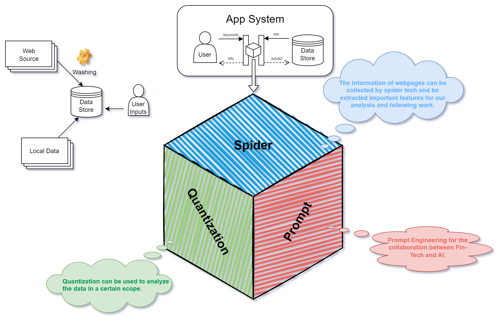

# FinTech-Integration

The concept frame of project idea
概念图

界面示意图

类别 | 功能 | 输出 | 用户交互参数
AvgLines | 判断股票是否收敛（均线靠近） | DataFrame(股票代码) | 时间窗口长度、P阈值
GeneralIndicator | 计算多周期涨幅（RPS）和波动率 | DataFrame + 股票筛选表 | 波动率周期、RPS和波动率筛选条件
MomentumApp | 获取动量值前 N 强股票并可视化 | DataFrame(TopN) + 动量柱状图 | 动量周期N、TopK个数

完美！现在你已经提供了三个独立的股票分析组件：

---

### ✅ 三个类功能对比总结：

| 类别 | 功能 | 输出 | 用户交互参数 |
|------|------|------|----------------|
| `AvgLines` | 判断股票是否收敛（均线靠近） | `DataFrame(股票代码)` | 时间窗口长度、P阈值 |
| `GeneralIndicator` | 计算多周期涨幅（RPS）和波动率 | `DataFrame` + 股票筛选表 | 波动率周期、RPS和波动率筛选条件 |
| `MomentumApp` | 获取动量值前 N 强股票并可视化 | `DataFrame(TopN)` + 动量柱状图 | 动量周期N、TopK个数 |

---

